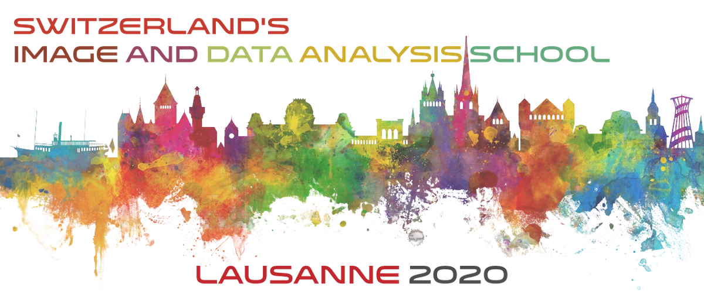

## Deep Learning for image analysis - Exercises  

---

### Setup

Please prepare the following setup steps before the exercise on Wednesday starts
 
1. Setup Fiji

Due to the downtime of Fiji/ImageJ update sites, we created prebuilt Fiji versions with all plugins preinstalled. Please download the respective version for your platform and unzip it: 

[Linux](https://drive.switch.ch/index.php/s/9eULhevg9gMPNbj) , [MacOSX](https://drive.switch.ch/index.php/s/twLVBUhl5fSDOMO), or [Windows](https://drive.switch.ch/index.php/s/y2ytRVUaexlxBZG).

2. Install deepImageJ in Fiji

- download the [deepImageJ plugin](https://github.com/deepimagej/deepimagej-plugin/releases/download/1.1.0/DeepImageJ_CPU_dependencies.zip) 
- unpack the resulting zip file which should create a folder `DeepImageJ_CPU_dependencies` containing lots of jar files:

  

- Copy all jar files into the `jars` subfolder of your Fiji installation:

  

2. Google Colab 

We are going to use google colab for the neural network training demonstration as it provides easy access to a jupyter notebook environment and a GPU. Google colab however needs a google account, so please create one and then login to your account at the start of the exercise.

---

### Exercise 1 - Applying DL models in Fiji

Now, we have 2 alternative projects, please pick one of them that is closest to the the median interest of your group:

#### Alternative 1a - Denoising with Noise2Void (20 mins)

DL-based Denoising in Fiji with Noise2Void

1. Open Fiji 

2. Load a low SNR (noisy) image containing some cells: [Low SNR image](https://github.com/maweigert/zidas_2020_DL_intro_Part_2/raw/master/exercise1a/hepatocytes_low_snr.tif) [1]

3. Apply a median filter (poor man's denoising) of different radii to test the output of a simple baseline method:
`Process > Filters > Median`

4. Open the Noise2Void Plugin 
`Plugins > CSBDeep > N2V > N2V train + predict`  

5. Adjust training parameters

For this exercise, we will adjust some parameters, such that training finishes before the night falls :) 

 - set `epochs=50` and `number of steps = 30`.    
 - press `Ok` 
 - While waiting for the training to finish, discuss the following questions in your group:
    - What is train/val/test split? Why is it important? 
    - 
 
6. After training, prediction time!  

Use "predict with last checkpoint" after the training has finished.

7. Compare with a high SNR image of the same field of view: [High SNR image](https://github.com/maweigert/zidas_2020_DL_intro_Part_2/raw/master/exercise1a/hepatocytes_high_snr.tif) [1]

#### Alternative 1b - Nuclei Segmentation with StarDist (20mins)

We gonna learn about 

1. Open Fiji 

2. Load a low SNR (noisy) image containing some histone labeled HeLa cells: [Low SNR image](https://github.com/maweigert/zidas_2020_DL_intro_Part_2/raw/master/exercise1b/fluo_low.tif)

3. Try to apply a thresholding to test the output of a simple baseline method:

Use `Image > Adjust > Threshold` and see what different values would give you (hint: it shouldn't look too good).
Press `Reset` and close the window, as we don't want to apply the threshold.

4. Open the StarDist plugin

`Plugins > StarDist > StarDist 2D`

In the options

- select a pertrained model: `Versatile (fluorescent nuclei)` (as we have fluorescent cells after all) 
- Check `Normalize Image` (should be the default)
- predict!

5. Compare with high SNR image

There is a high SNR image of the same field of view: [High SNR image](https://github.com/maweigert/zidas_2020_DL_intro_Part_2/raw/master/exercise1b/fluo_high.tif). Apply StarDist to this image and compare the results.

6. Load a histopathologie (H&E stain) [image of human retina](https://github.com/maweigert/zidas_2020_DL_intro_Part_2/raw/master/exercise1b/histo_retina.tif). Mind that this time, the image is a 3 channel rgb image (and not a single channel image as before). 

7. Apply StarDist plugin, but this time with a H&E model (`Versatile (H&E stain)`).

8. Play around by applying StarDist to your own (or other) 2D images containing cell nuclei. 

---

#### Exercise 2 - Training DL models

Again, there are 2 alternative projects, please pick one of them:

#### Exercise 2a

CARE colab 

#### Exercise 2b

StarDist colab 

---
---

##### Image Credits:

- [1] Broad Bioimage Benchmark Collection
- [2] Fabián Segovia-Miranda

